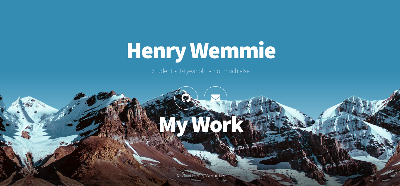

# My Portfolio

Welcome to my personal portfolio! This repository contains the source code for my [portfolio](https://henrywemmie.me/).

## Introduction

I am Henry Wemmie, a 14-year-old student passionate about computers and technology. This portfolio showcases some of my projects and provides a glimpse into my skills and interests.

## Features

- **Navigation:** Easily navigate through different sections of the portfolio.
- **External Links:** Connect with me on GitHub or send me an email.
- **Responsive Design:** The website is designed to be responsive, ensuring seamless use across various devices.

## Usage

To view the portfolio, simply open [this](https://henrywemmie.me/) link.

You can also host this on any static host.

## External Links

- [GitHub](https://github.com/hankypoo7)
- [Email](https://mail.google.com/mail/u/0/#inbox?compose=DmwnWrRlQXwtNdTPLQmBrrvRQpzxDjkSxLRSwNLvdkqhQtjLwFhNrBPlktzkLwVPQnbsbbMnSsDB)

## Preview

## Author

- Henry Wemmie
- Website: [henrywemmie.me](https://henrywemmie.me)

## License

This project is licensed under the MIT License - see the [LICENSE](https://raw.githubusercontent.com/hankypoo7/henrywemmie.me/main/LICENSE) file for details.
